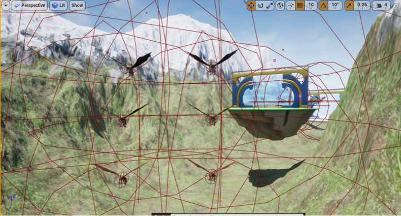

# UFO Game
**Made by UE4**

**Author**: Yucheng  Feng, Bohan Liu, Yuhan Lu, Jingze He, Kaiyue Zhang

## About

This game is a non-conventional co-op flight simulator game. The philosophy is to expose the difficulty in coordinating the different engines and aiming mechanism to the player for them to cooperate and have fun.

The core of the game is the cooperation of the players to control the UFO flying, get insights from the overcooked, each player would control an engine of the ufo, the direction and magnitude for example, such that three players could determine the direction and the pose of the UFO together. Meanwhile, The player can stay in the UFO to aim and shoot the enemies.

The map of the game happens in the future world, which has enemies to shoot projectiles such as magic balls or future bullets to UFO. The player should carefully manipulate the UFO to avoid enemies' attacks and chases. Also, there are holes in the map to allow UFO to pass through. Otherwise, UFO hp will decrease on hit. Sometimes, the map and terrain would be tricky, which requires players to cooperate well enough to fly through.

Overall, players can enjoy the game in an imaginative way.

## Demo Image
You can watch our demo video [here](https://www.youtube.com/watch?v=_BbfyPEBia4&t=367s)

### player start

### shooting

### landscape

### enemy design

### boss

### over height remind

### restart UI

